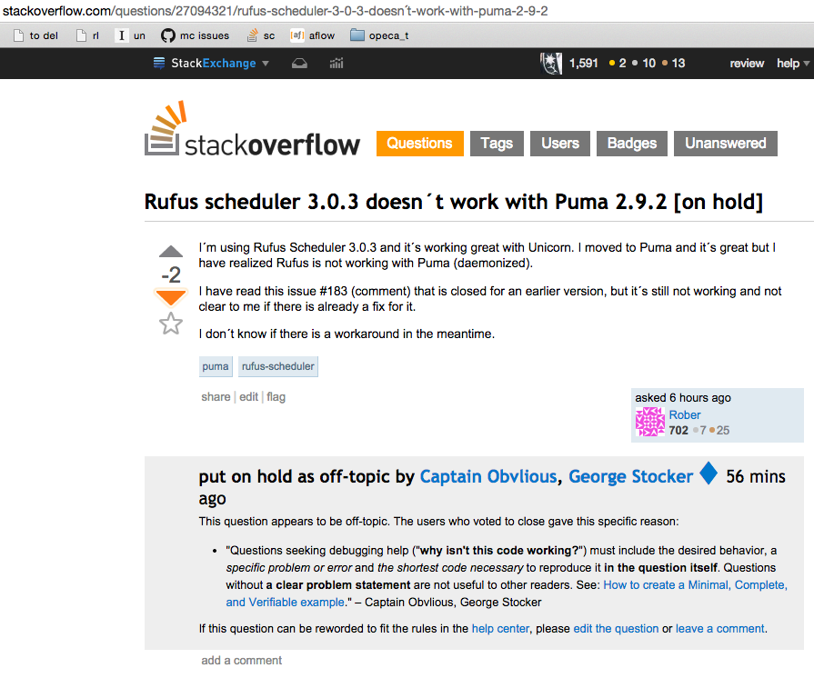

# for_rober

answering: http://stackoverflow.com/questions/27094321/rufus-scheduler-3-0-3-doesn%C2%B4t-work-with-puma-2-9-2

<a href="https://raw.githubusercontent.com/jmettraux/for_rober/da6d5db78573e33ecff12b76800241fb46bfc7fd/docs/screenshot_20141124_125519_jst.png" target="_blank"></a>

## to run

tested on `ruby 1.9.3p392 (2013-02-22 revision 39386) [x86_64-linux]`

```sh
git clone https://github.com/jmettraux/for_rober.git
cd for_rober/
bundle install
ruby serve.rb
```

## license

MIT, see [LICENSE.txt](LICENSE.txt)

